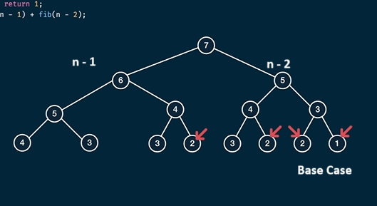
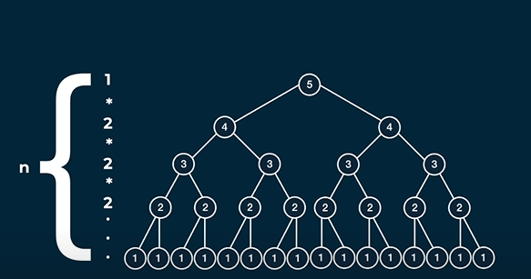
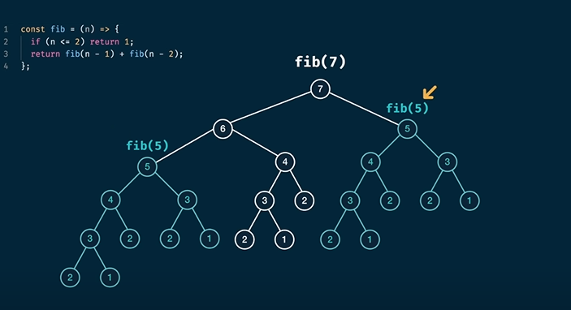
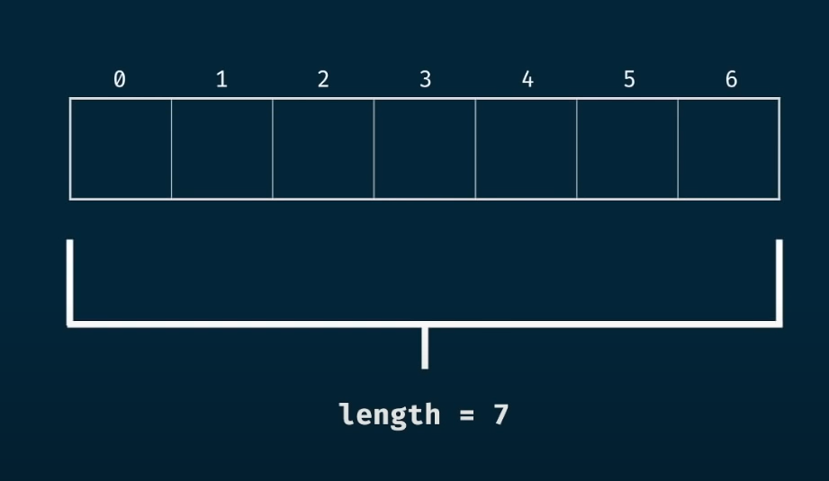
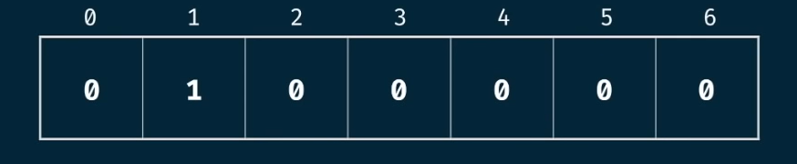
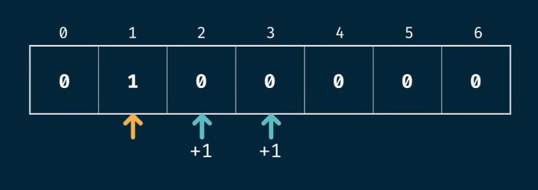
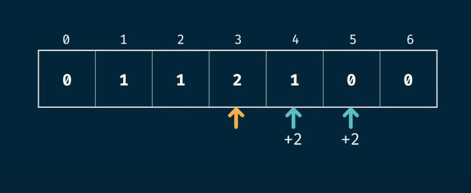

## Example 1: Fibonacci Problem

The Fibonacci sequence is defined as:

| n      | 1 | 2 | 3 | 4 | 5 | 6 | 7 | 8 | 9 | ... |
|--------|---|---|---|---|---|---|---|---|---|-----|
| fib(n) | 1 | 1 | 2 | 3 | 5 | 8 | 13| 21| 34| ... |

---

### Recursive Implementation

```python
def fib(n):
    if n <= 2:
        return 1
    return fib(n-1) + fib(n-2)
```

- **Drawback:** This implementation is slow due to repeated calculations in recursion.

#### Tracing `fib(7)`




- **Time Complexity:** O(2<sup>n</sup>)
- **Space Complexity:** O(n) (height of the recursion tree)

For example, `fib(50)` would require approximately 2<sup>50</sup> steps, which is computationally expensive.

---

### Observing the Pattern



Notice that the left and right subtrees return the same values. We can reuse these calculations.

---

## Dynamic Programming Approach

Dynamic programming decomposes the problem into smaller subproblems and eliminates overlapping computations.

### Memoization (Top-Down DP)

Memoization stores the results of expensive function calls and returns the cached result when the same inputs occur again.

```python
def fib(n, memo={}):
    if n in memo:
        return memo[n]
    if n <= 2:
        return 1
    memo[n] = fib(n-1, memo) + fib(n-2, memo)
    return memo[n]
```


- **Benefit:** This approach stores previously computed values, greatly improving efficiency.

---

### Tabulation (Bottom-Up DP)

Tabulation solves the problem iteratively, usually by filling up a table (array) from the base cases up.

#### Example Table

| n      | 0 | 1 | 2 | 3 | 4 | 5 | 6 | 7 | 8 | 9 | ... |
|--------|---|---|---|---|---|---|---|---|---|-----|
| fib(n) | 0 | 1 | 1 | 2 | 3 | 5 | 8 | 13| 21| 34| ... |

#### How Tabulation Works

- For `fib(6)`, instead of using recursion, we use iteration.
- We create an array from 0 to 6 (7 elements).
- Initialize all elements to 0, then seed the starting values: index 0 as 0 and index 1 as 1.



- The current position is marked in yellow; the next two positions (blue) are updated by adding the current value.




- Continue this process iteratively:




- **Time Complexity:** O(n)
- **Space Complexity:** O(n)

Tabulation is just an iterative process that fills up a table, making it efficient and easy to implement.

---

**Summary:**

- **Recursive approach:** Simple but inefficient due to repeated calculations.
- **Memoization:** Top-down DP, avoids recomputation by caching results.
- **Tabulation:** Bottom-up DP, builds up the solution iteratively in a table.

Use dynamic programming (memoization or tabulation) for efficient Fibonacci number computation!
