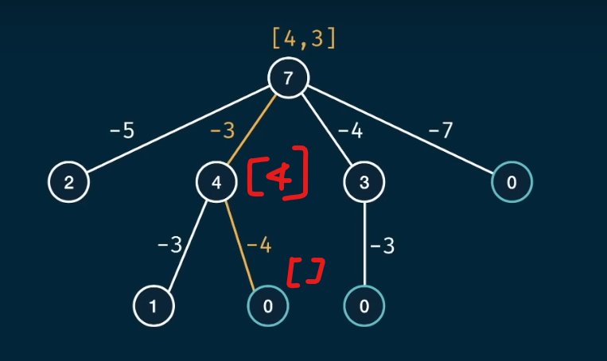
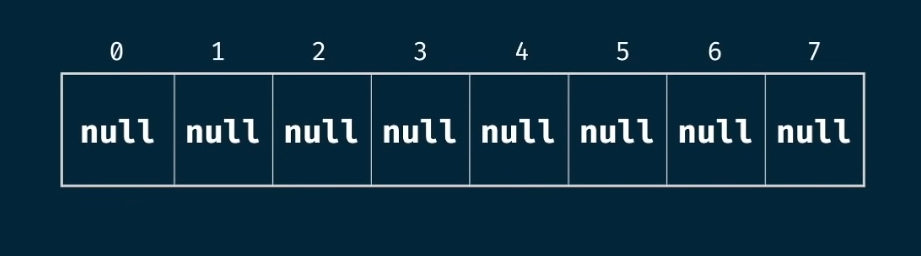
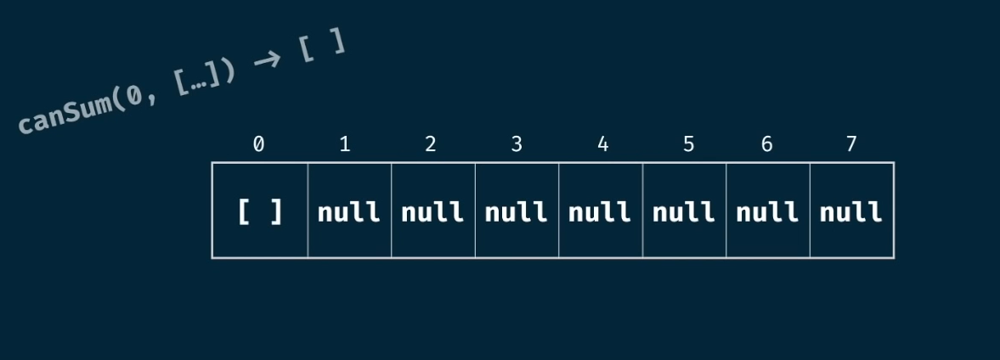
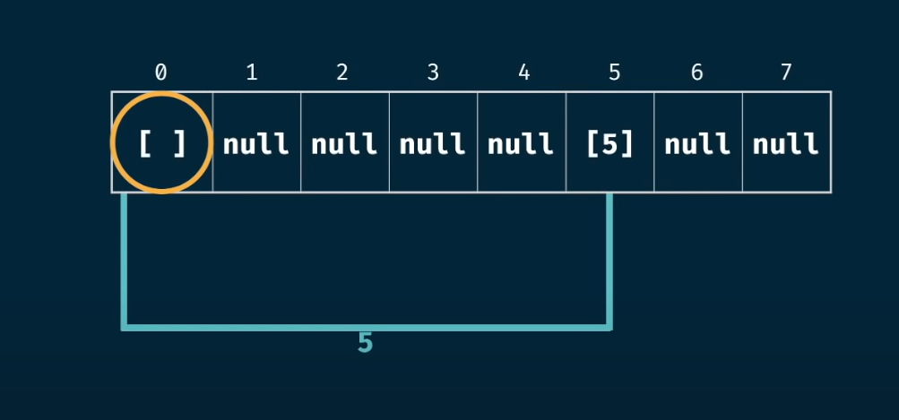
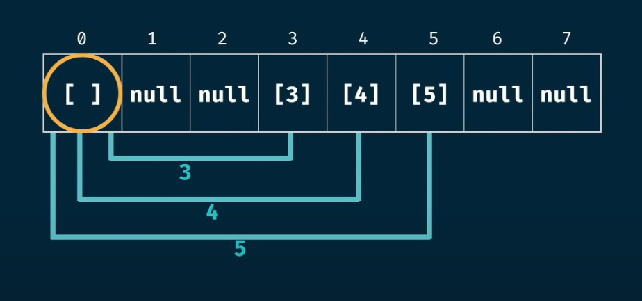
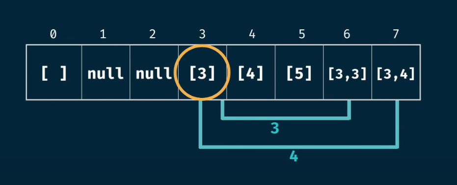
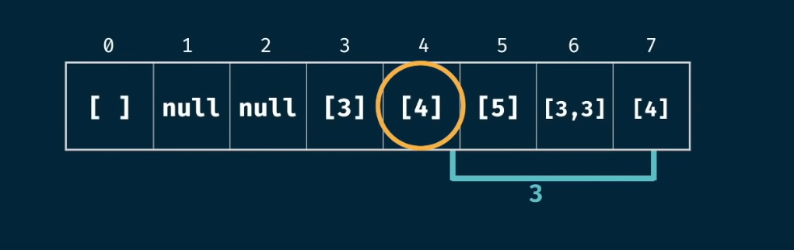

# HowSum Problem

## Problem Statement

Write a function `howSum(targetSum, numbers)` that takes in a target sum and an array of numbers as arguments.  
The function should return an array containing **any combination of elements** that add up exactly to the `targetSum`.  
If there is **no combination** that adds up to the `targetSum`, then return `null`.

> **Note:**  
> If multiple combinations are possible, you may return any single one.

---

## Understanding the Problem

This problem is similar to the `canSum` problem, but instead of returning a boolean, we have to return the actual array values.

---

## Test Cases

1. **Input:** `howSum(7, [5, 4, 3, 7])`  
    **Output:** `[3, 4]` or `[7]` (any one combination)

2. **Input:** `howSum(8, [2, 3, 5])`  
    **Output:** `[2, 2, 2, 2]` or `[3, 5]` (any one combination)

3. **Input:** `howSum(7, [2, 4])`  
    **Output:** `null` (no possible output)

4. **Input:** `howSum(0, [1, 2, 3])`  
    **Output:** `[]` (empty array)

---

## Visual Explanation

Let's visualize the problem:

---

## Complexity Analysis

Let:
- `m` = target sum
- `n` = array length

| Approach      | Time Complexity      | Space Complexity   |
|---------------|---------------------|--------------------|
| Brute Force   | O(nm * m) | O(m)               |
| Memoized      | O(n * m2) | O(m2)   |

---

## Using Tabulation

Unlike `canSum`, here we need to return an array instead of just `true` or `false`.

**Example:**  
`howSum(7, [5, 3, 4])` → `[4, 3]`

### Step 1: Table Creation

- The table should have a length of `targetSum + 1`.
- Each index will store either `null` (if not reachable) or an array (combination that sums to the index).

### Step 2: Seed Value

- We can always get 0 by using an empty array.
- So, at index 0, we set an empty array: `table[0] = []`.

**Example Table Initialization:**

### Step 3: Iteration

- Iterate through the table.
- For each reachable index, try to add each number from the array and update the table accordingly.

**Seed Value Example:**

`canSum(0, [...]) → []`

So, at index 0, we have an empty array.

**Table Iteration:**

- If the value at an index is `null`, it means it's not reachable, so skip further manipulation.
- When you reach a valid index, add each number and update the table.

**Example Update:**

---

## Final Complexity (Tabulation)

Let:
- `m` = targetSum
- `n` = numbers.length

- **Time Complexity:** O(m2 * n)
- **Space Complexity:** O(m2)

---