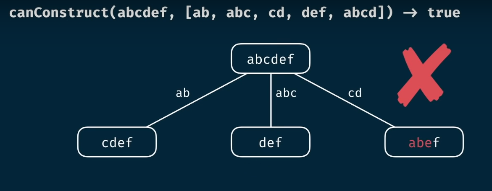
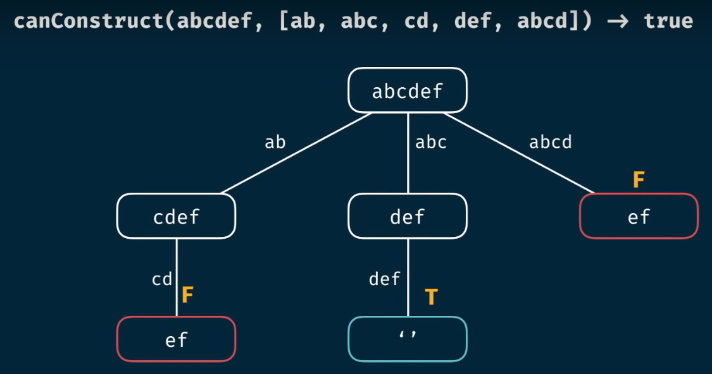
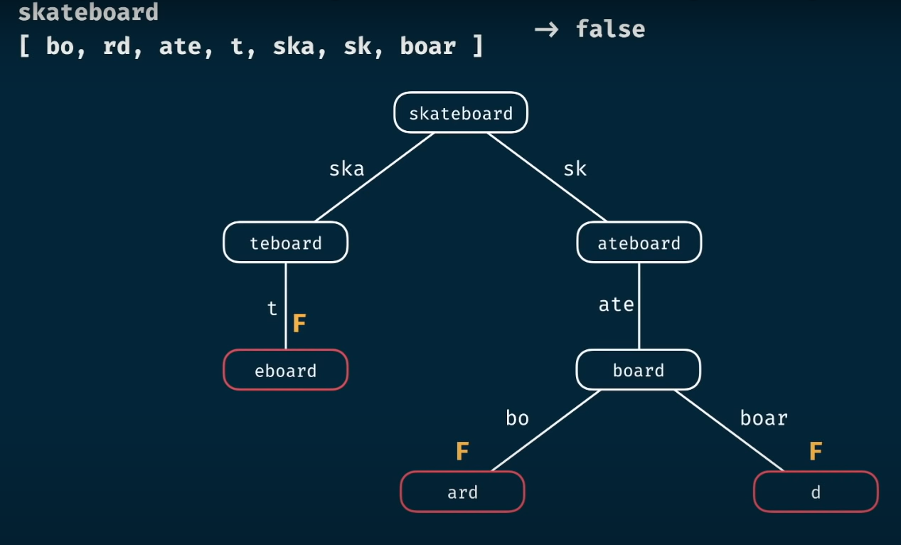
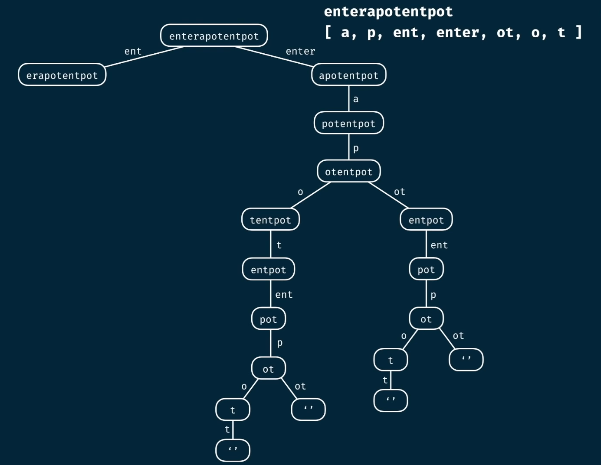
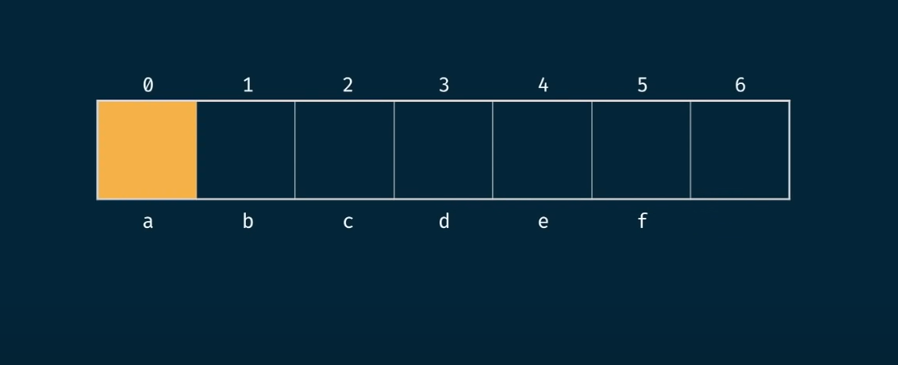
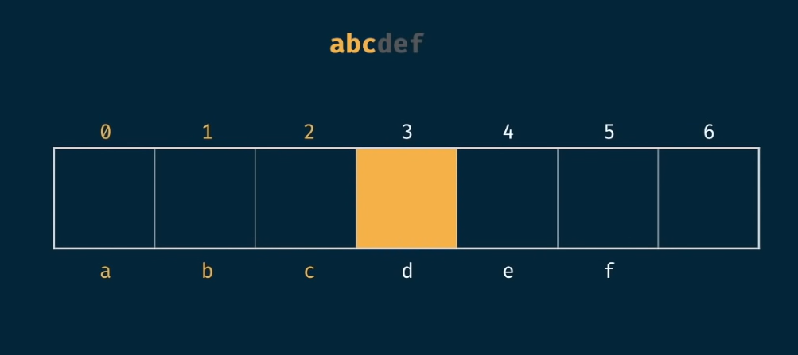
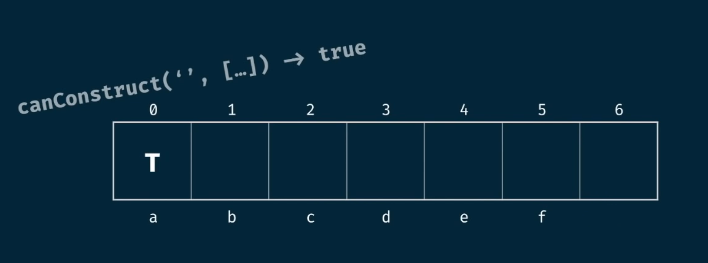

# 🧩 Can Construct Problem: Dynamic Programming Deep Dive

## 📝 Problem Statement

Write a function `canConstruct(target, wordBank)` that accepts a target string and an array of strings.  
The function should return a boolean indicating whether or not the `target` can be constructed by concatenating elements of the `wordBank` array.  
You may reuse elements of `wordBank` as many times as needed.

---

## 🤔 Understanding the Problem

To solve this, we need to build the `target` string using the words from `wordBank`.  
The base case: if the `target` is an empty string, return `true` (since we can always construct an empty string).

> **Note:** We should only remove elements from the prefix of the string, not from the middle, to avoid inconsistencies.

If a word from `wordBank` matches the prefix of `target`, we can remove it and recursively check the remainder.

---

## 🚫 Example: When Construction is Not Possible

Let's see a scenario where construction fails, using the word "skateboard":

---

## 🔄 Recursive Approach & Complexity

Recursion can lead to poor performance due to repeated subproblems.

- Let `m = target.length`
- Let `n = wordBank.length`
- The height of the recursion tree is `m` (worst case: single character choices).

**Brute Force Complexity:**  
- ⏱️ Time: `O(n^m * m)`  
- 🗄️ Space: `O(m^2)`

**Memoized Complexity:**  
- ⏱️ Time: `O(n * m^2)`  
- 🗄️ Space: `O(m^2)`

---

## 📊 Tabulation Approach

Let's solve this problem using tabulation (bottom-up dynamic programming).

We create a table (array) of length `target.length + 1` to represent all prefixes of the target string.  
Each index represents whether the prefix up to that point can be constructed.

- At index `0`, we represent the empty string.  
- We seed `True` at index `0` because an empty string is always constructible.

- At index `1`, we look at `'a'`
- At index `2`, we look at `'ab'`
- At index `3`, we look at `'abc'`
- At index `6` (the end), we look at the whole string `'abcdef'`

---

## 🧮 Assigning Values in the Table

What values do we assign at each location?

- Seed `True` at index `0` (empty string is always possible).
- All other values start as `False`.

To solve:
- Iterate through each position in the table.
- For each word in `wordBank`, if the word matches the substring starting at the current position, set the value at the position `current index + len(word)` to `True`.

---

## 💻 Let's Code!

Before we code, let's quickly discuss the tabulation complexities:

- Let `m = target.length`
- Let `n = wordBank.length`

**Tabulation Complexity:**  
- ⏱️ Time: `O(m^2 * n)`  
- 🗄️ Space: `O(m)`

---

This approach efficiently determines if the target string can be constructed from the word bank using dynamic programming! 🚀
