# 🧩 All Construct Problem (Dynamic Programming)

## Problem Statement

Write a function `allConstruct(target, wordBank)` that accepts a target string and an array of strings.  
The function should return a 2D array containing **all the ways** that the target can be constructed by concatenating elements of the `wordBank` array.  
Each element of the 2D array should represent one combination that constructs the target.

- You can reuse elements of the `wordBank` as many times as needed.

---

## 💡 Discussion

We want to return **all possible scenarios**.

- **Edge Case:**  
    - If no construction is possible, return an empty array:  
        ```js
        allConstruct('hello', ['cat', 'dog', 'mouse']) // ➡️ []
        ```
    - If the target is an empty string, return `[[]]` (one way to construct the empty string):  
        ```js
        allConstruct('', ['cat', 'dog', 'mouse']) // ➡️ [[]]
        ```

---

## 🧠 Visualizing the Solution

For valid scenarios, the recursion tree can look like this:

<p align="center">
    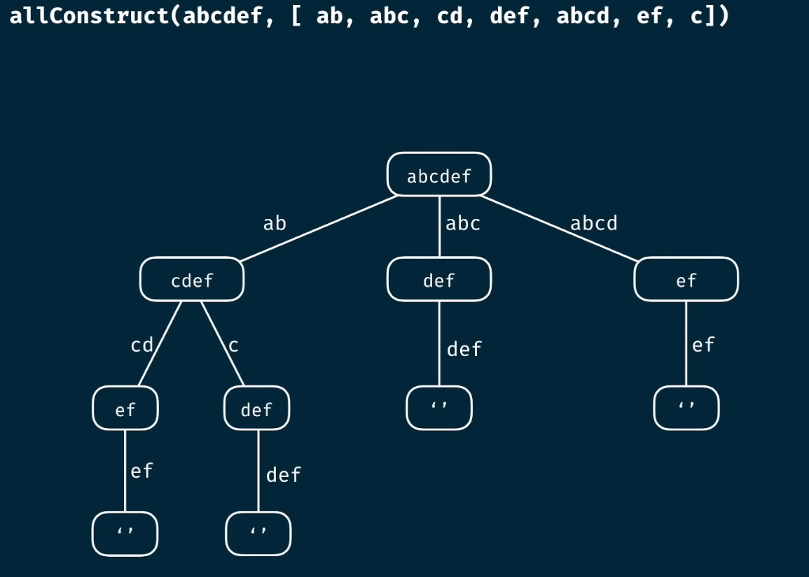
</p>

<p align="center">
    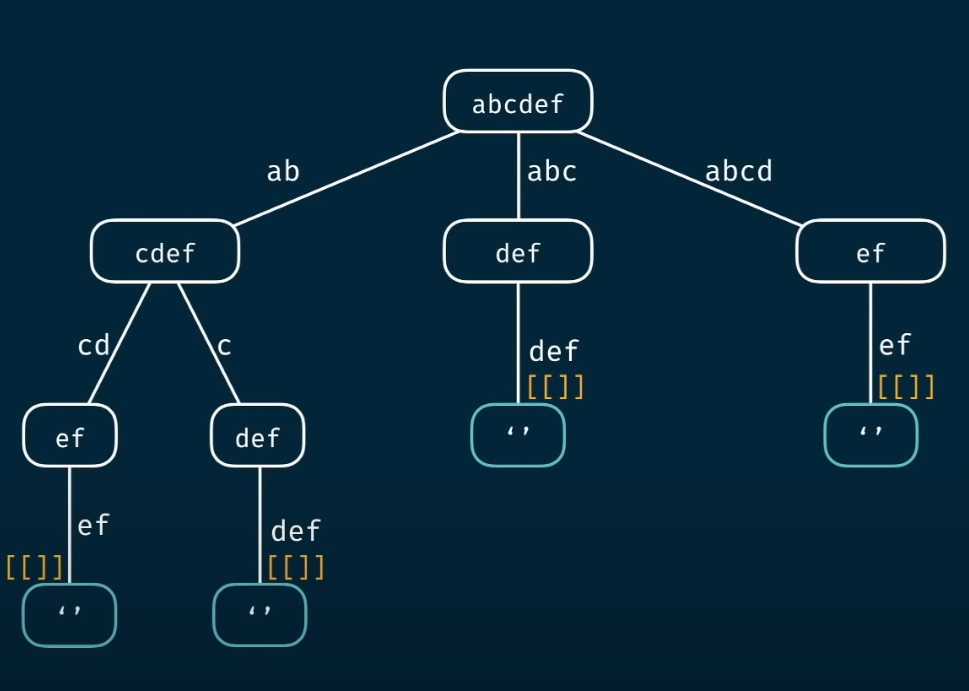
</p>

<p align="center">
    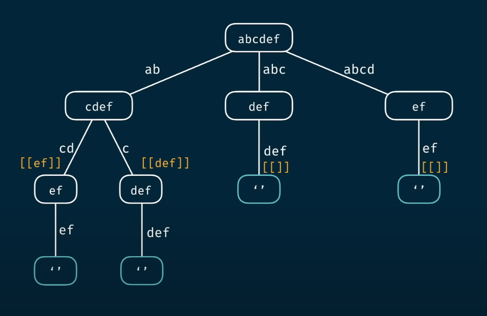
</p>

<p align="center">
    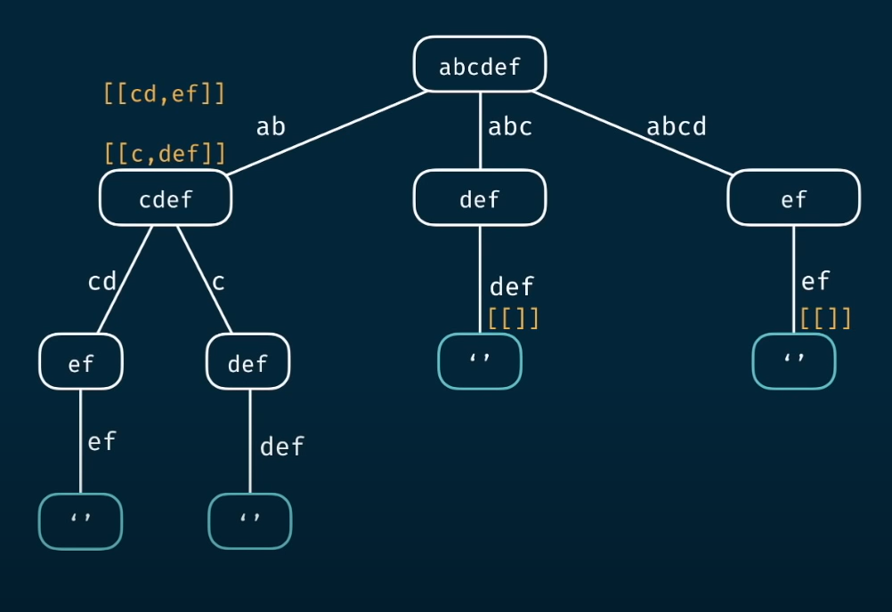
</p>

<p align="center">
    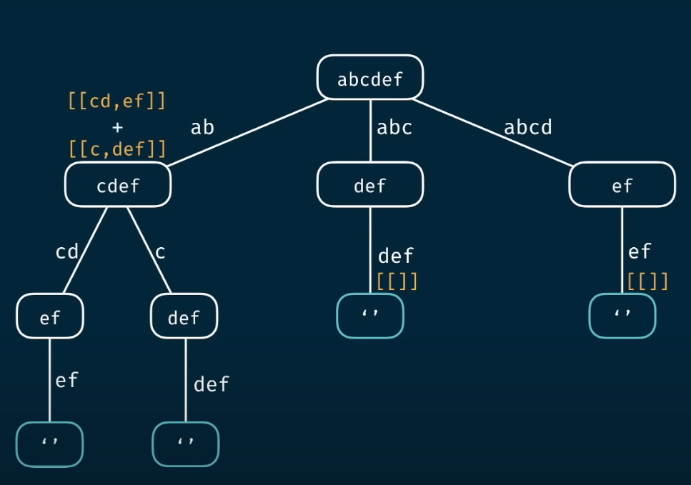
</p>

We reconstruct the array to concatenate and get:
```js
[['cd', 'ef'], ['c', 'def']]
```

<p align="center">
    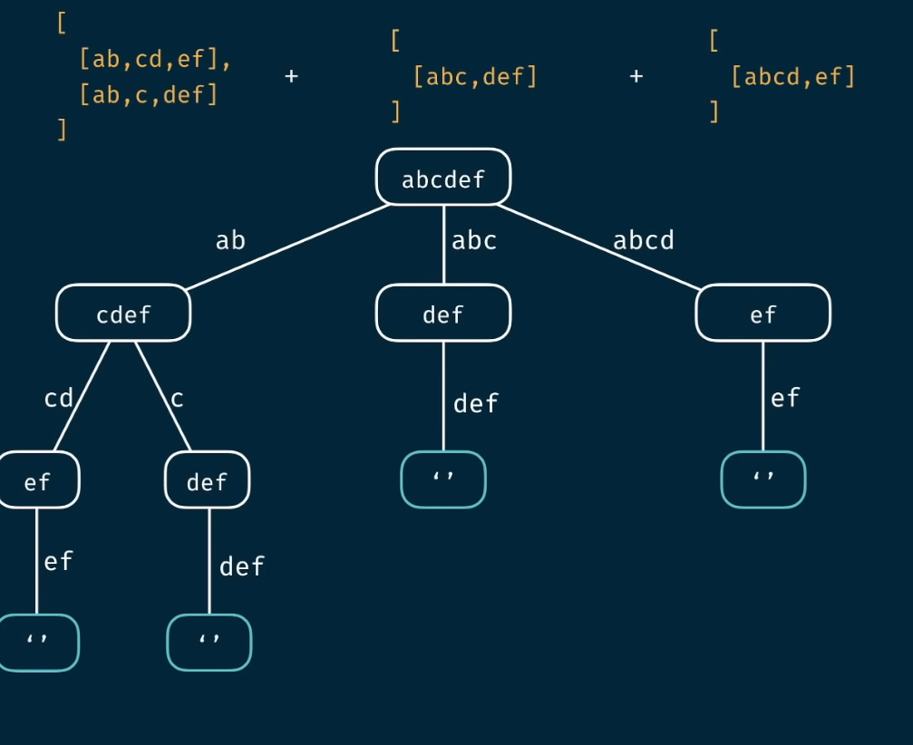
</p>

In the end, the output will be:
```js
[['ab', 'cd', 'ef'], ['ab', 'c', 'def'], ['abc', 'def'], ['abcd', 'ef']]
```

---

## 📝 Another Example

<p align="center">
    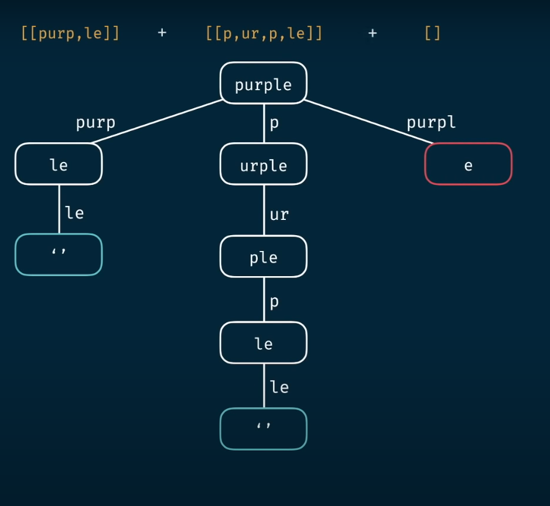
</p>

---

## ⏱️ Complexity Discussion

Let:
- `m = target.length`
- `n = wordBank.length`

At the base of the recursion tree, we can have up to **O(n^m)** child nodes, resulting in that many subarrays.

- **Time Complexity:** `O(n^m)`
- **Space Complexity:** `O(m)`

---

## 🏗️ Tabulation Approach

Let's solve this problem using **Tabulation**:

```js
allConstruct('abcdef', ['ab', 'abc', 'cd', 'def', 'abcd', 'ef', 'c'])
```

There are multiple ways to construct the target:
```js
[
    ['ab', 'cd', 'ef'],
    ['ab', 'c', 'def'],
    ['abc', 'def'],
    ['abcd', 'ef']
]
```

For example:
- `allConstruct('', ['cat', 'dog']) // ➡️ [[]]` (an empty combination)
- `allConstruct('bird', ['cat', 'dog']) // ➡️ []` (no possible case)

**Step 1:**  
The table should be of size `target.length + 1`, seeded with an empty array at the 0th index.

<p align="center">
    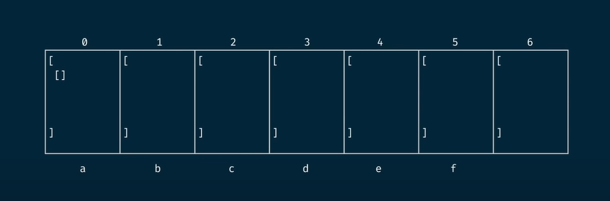
</p>

<p align="center">
    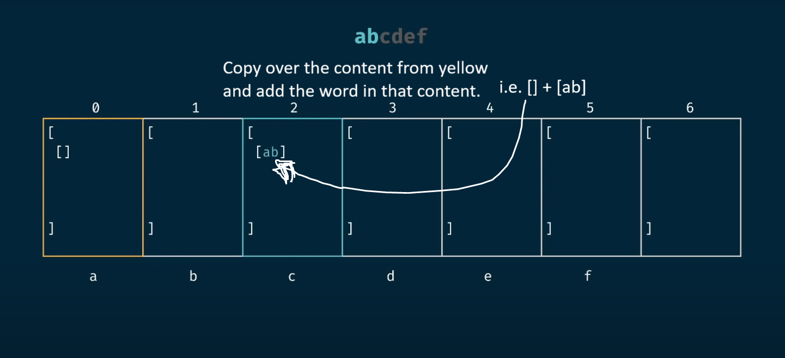
</p>

**After 1st iteration:**

<p align="center">
    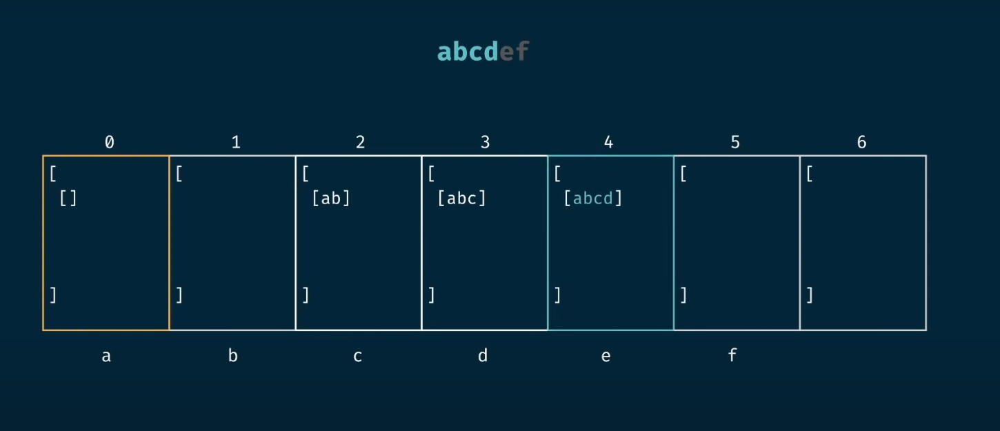
</p>

We look for the starting position `'b'` (not present), then move to the 2nd index `'c'`.

<p align="center">
    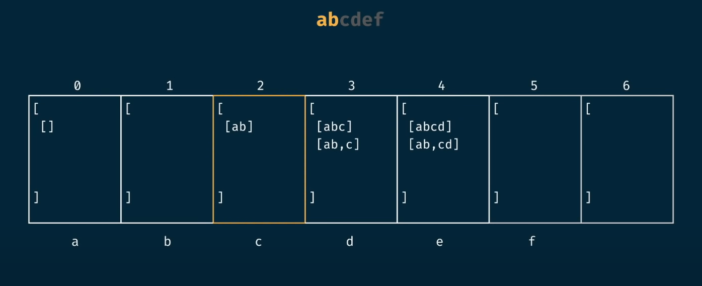
</p>

**Finally, after all iterations:**

<p align="center">
    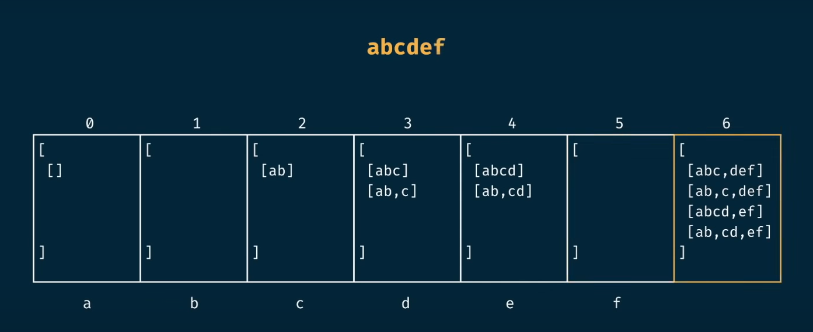
</p>

---

## 📊 Complexity Recap

Let:
- `m = target.length`
- `n = wordBank.length`

- **Time Complexity:** `O(n^m)`
- **Space Complexity:** `O(n^m)`

---

> 🚀 **Tip:**  
> Use tabulation for better performance and to avoid stack overflow on large inputs!
