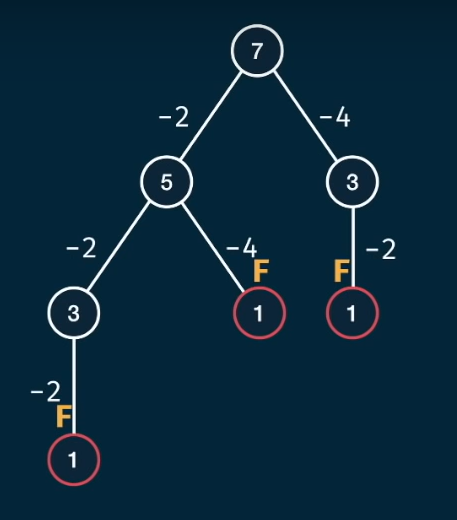
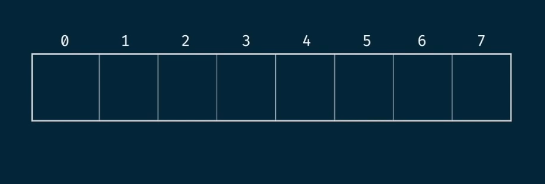
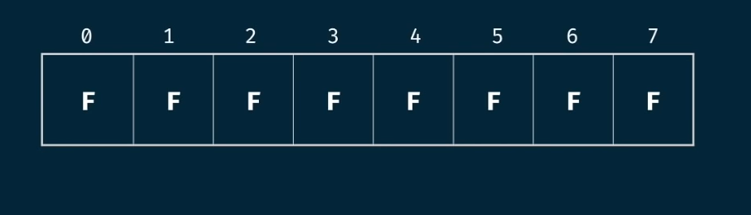
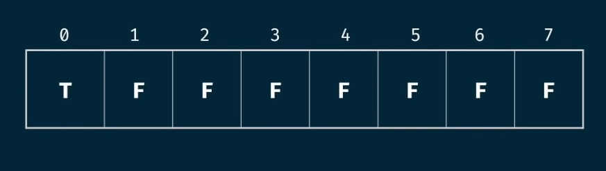
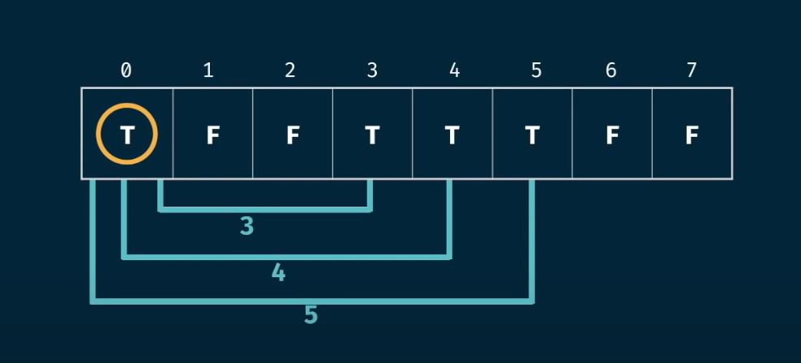
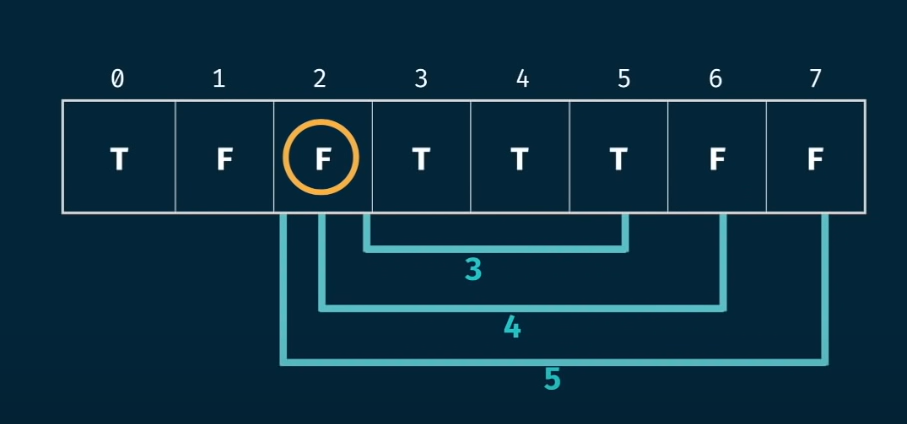
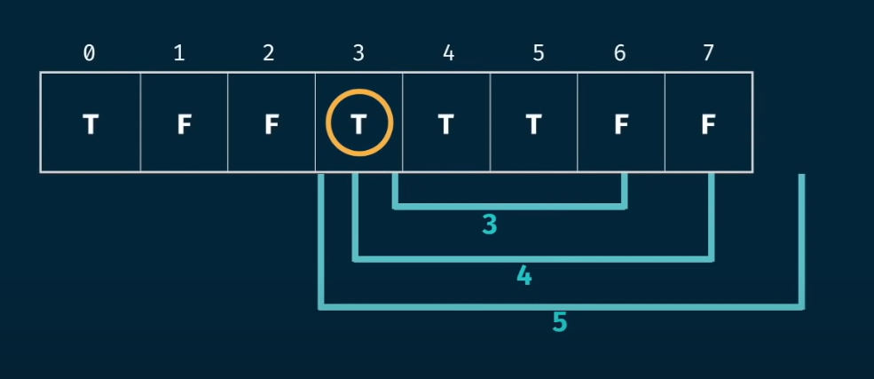
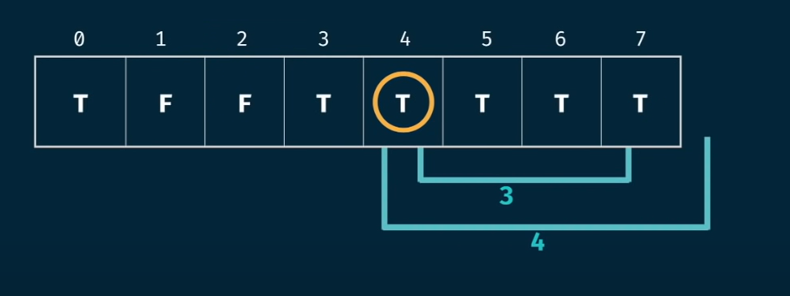
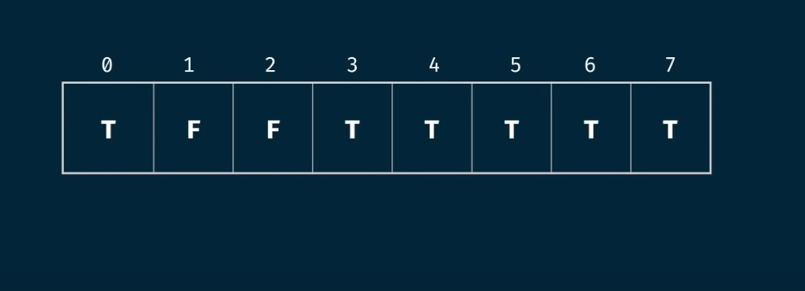

# CanSum Problem — Tabulation Approach

## Problem Statement

Write a function `canSum(targetSum, numbers)` that takes in a `targetSum` and an array of numbers as arguments. The function should return a boolean indicating whether or not it is possible to generate the `targetSum` using numbers from the array.

- You may use an element of the array as many times as needed.
- You may assume that all inputs are non-negative.

---

## Discussion

### Recursive Breakdown

If the target cannot be broken down to 0, the answer is `false`:

---

## Tabulation Approach

### Step 1: Table Size

For tabulation, we need to decide the size of our table.  
We have two inputs: `targetSum` and `numbers`.  
Since we can reuse numbers, the array size doesn't shrink.  
We focus on the `targetSum` — so the table size will be `targetSum + 1`.

**Example:**  
For `canSum(7, [5, 3, 4])`, the table size is `7 + 1 = 8`.

---

### Step 2: Table Initialization

Each element in the table represents whether the corresponding sum is possible.  
Since the output is boolean, initialize all values to `false` (assuming no sum is possible initially).

---

### Step 3: Seed Value

The base case:  
If `targetSum == 0`, return `true` (since we can always make 0 sum with no elements).

So, set `table[0] = true`.

---

### Step 4: Iterative Implementation

- Start from index 0.
- For every `true` position in the table, iterate through the numbers array.
- For each number, set `table[currentIndex + number] = true` (if within bounds).

**First Iteration:**  
At index 0, iterate through the numbers and set positions 5, 3, and 4 to `true` (if possible).

**Subsequent Iterations:**  
If the current element is `false`, skip.  
If `true`, update reachable positions.

At index 3 (which is `true`), update positions accordingly.

Skip numbers that would go out of bounds.

Continue this process for all indices.

---

### Step 5: Final Answer

If the last position (`table[targetSum]`) is `true`, it is possible to generate the target sum.

All `true` elements in the table represent possible sums.

---

## Complexity Analysis

- Let `m = targetSum`
- Let `n = numbers.length`

**Time Complexity:** `O(mn)`  
**Space Complexity:** `O(m)`

---

**Summary:**  
Use a boolean table of size `targetSum + 1`, seed `table[0] = true`, and iteratively update reachable sums. The answer is at `table[targetSum]`.