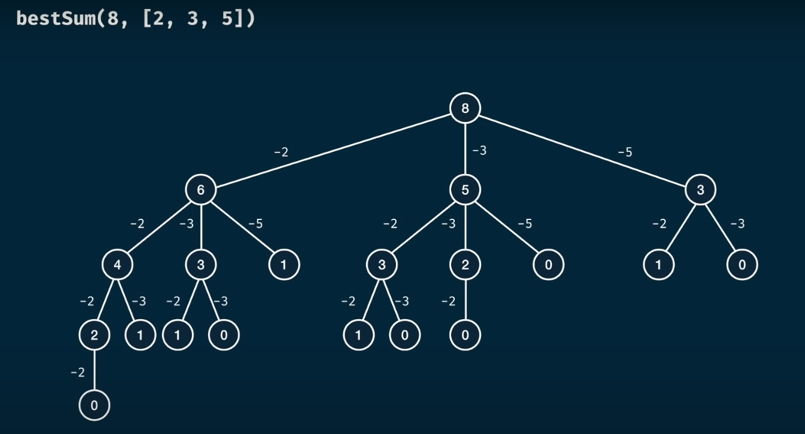
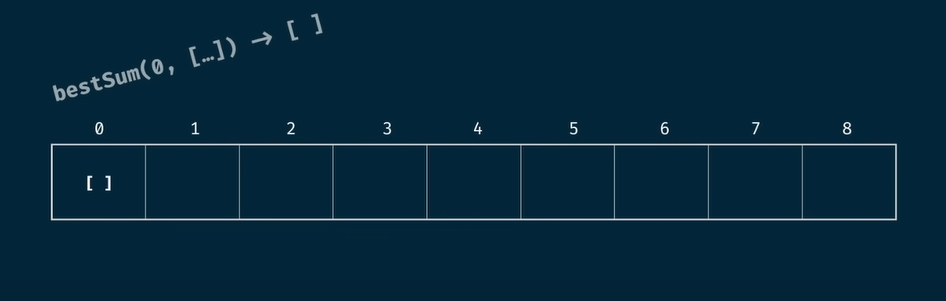
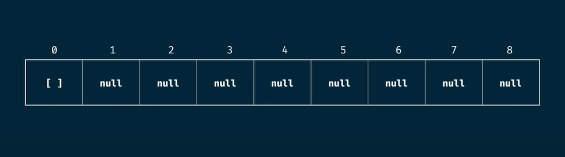
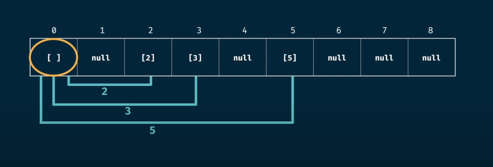

# 🏆 Best Sum Problem — Dynamic Programming

## 📋 Problem Statement

Write a function `bestSum(targetSum, numbers)` that takes in a `targetSum` and an array of numbers as arguments.  
The function should return an array containing the **shortest combination** of numbers that add up exactly to the `targetSum`.  
If there is a tie for the shortest combination, you may return any one of the shortest.

---

## 💡 Discussion

### Example 1

```js
bestSum(7, [5, 3, 4, 7])
```
- Possible combinations: `[3, 4]` and `[7]`
- **Best solution:** `[7]` (shortest)

### Example 2

```js
bestSum(8, [2, 3, 5])
```
- Possible combinations: `[2, 2, 2, 2]`, `[2, 3, 3]`, `[3, 5]`
- **Best solution:** `[3, 5]` (shortest)

---

## 🌳 Visualizing the Problem

For such problems, we have to try **every possible option**.  
The full recursion tree for `bestSum(8, [2, 3, 5])` would look like this:



---

## 🧑‍💻 Coding Approach

Let's write the code and discuss the complexity.

---

## ⏳ Time & Space Complexity

Let:
- `m` = target sum
- `n` = array length

### Brute Force

- **Time:** `O(n^m * m)`
- **Space:** `O(m^2)`

### Memoized

- **Time:** `O(n * m^2)`
- **Space:** `O(m^2)`

---

## 📊 Tabulation Approach

Let's see how tabulation works for `bestSum(8, [2, 3, 5])`:

- Possible outcomes: `[2, 2, 2, 2]`, `[2, 3, 3]`, `[3, 5]`
- **Best solution:** `[3, 5]`

### Step 1: Table Size

- The table size is based on the `targetSum`.

### Step 2: Seeding Values

- Seed the base case: `bestSum(0, [...]) = []`
- All other values are initialized as `null`.



### Step 3: Assign Nulls

- Assign all other values as `null`.



### Step 4: Iteration

- Iterate from index 0 of the table for each element.
- Add the value by concatenating the array.



- For `null` or `None` values, skip.
- Keep the shortest length combination.


---

## 📝 Summary

In tabulation, we **store the shortest combination** for each index up to the target sum.

### Tabulation Complexity

- `m` = target sum
- `n` = numbers array length

- **Time Complexity:** `O(m^2 * n)`
- **Space Complexity:** `O(m^2)`

---

> **Tip:** Dynamic programming is all about breaking problems into subproblems and storing their solutions for efficiency!

---