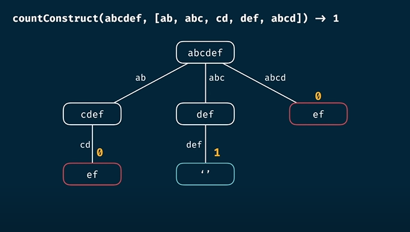
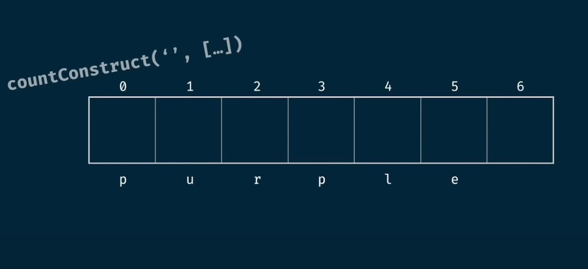
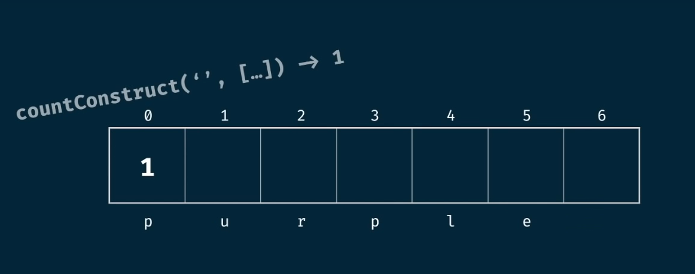
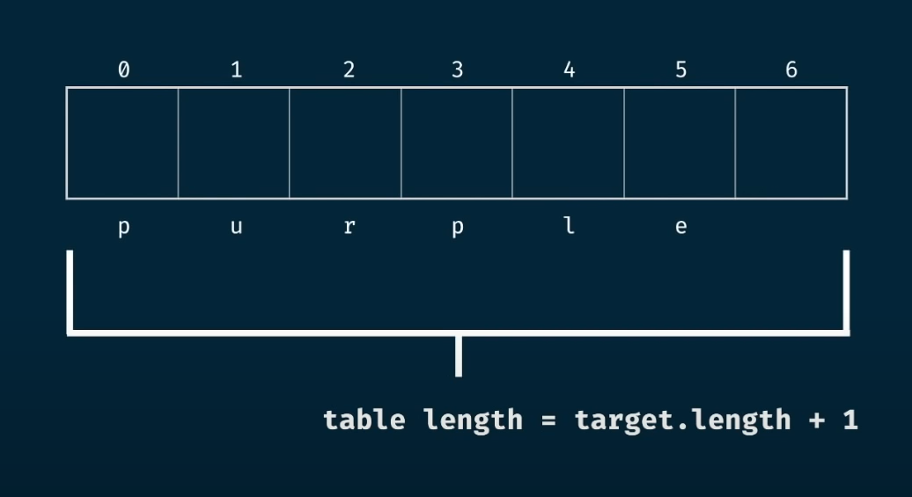
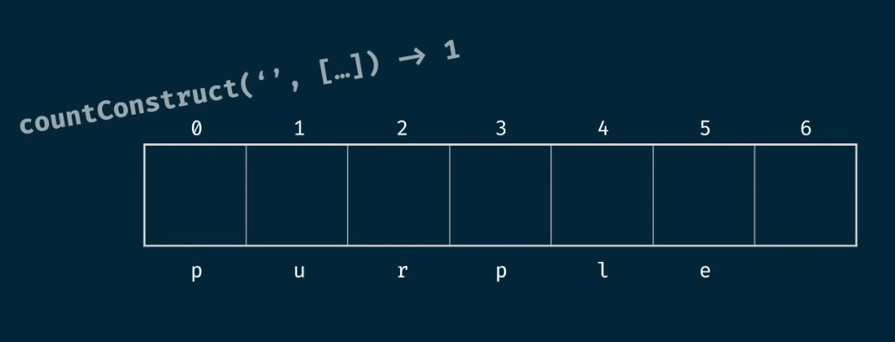
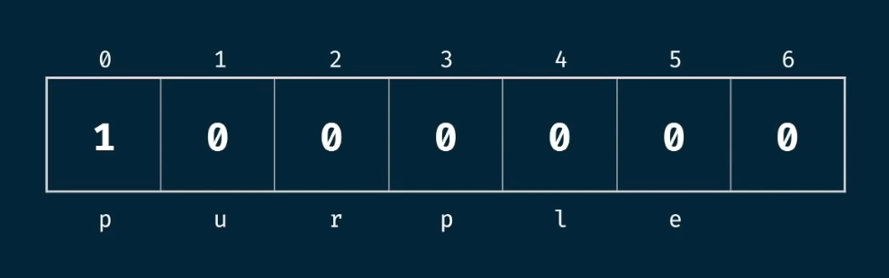

# 🧩 Count Construct Problem (Dynamic Programming)

## 🚩 Problem Statement

Write a function `countConstruct(target, wordBank)` that accepts a target string and an array of strings.  
The function should return the **number of ways** that the target can be constructed by concatenating elements of the `wordBank` array.

- You may reuse elements of `wordBank` as many times as needed.

---

## 💡 Discussion

We break down the problem as before:



---

## 📝 Example

Suppose:

```js
countConstruct("purple", ["purp", "p", "ur", "le", "purple"]) // ➡️ 2
```

---

## 📊 Complexity Analysis

Let:

- `m = target.length`
- `n = wordBank.length`

### Brute Force

- **Time:** O(n<sup>m</sup> * m)
- **Space:** O(m<sup>2</sup>)

### Memoized

- **Time:** O(n * m<sup>2</sup>)
- **Space:** O(m<sup>2</sup>)

---

## 🏗️ Tabulation Approach

As in previous tabulation problems, we take the size of the table as `target.length + 1`.

- The **seed value** is the empty string:  
    No matter what is given, we can always generate the empty string.



- So, we put value `1` at `index = 0`:



- All other values in the array are initialized to `0`.

---

## 🔄 Algorithm Steps

1. **Initialize** a table of size `target.length + 1` with all zeros.
2. **Set** `table[0] = 1` (one way to construct the empty string).
3. **Iterate** through the table:
        - For each position, if the word from `wordBank` matches the substring starting at that position, add the current count to the position `i + word.length`.





---

## ⏱️ Complexity (Tabulation)

- **Time:** O(m<sup>2</sup> * n)
- **Space:** O(m)

---

## 💻 Let's Code!

```js
function countConstruct(target, wordBank) {
    const table = Array(target.length + 1).fill(0);
    table[0] = 1;

    for (let i = 0; i <= target.length; i++) {
        if (table[i] !== 0) {
            for (let word of wordBank) {
                // If the word matches the substring starting at position i
                if (target.slice(i, i + word.length) === word) {
                    table[i + word.length] += table[i];
                }
            }
        }
    }

    return table[target.length];
}
```

---

> 📝 **Summary:**  
> The tabulation approach efficiently counts the number of ways to construct the target string using the given word bank, with optimal time and space complexity.

