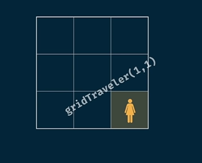

# Grid Traveller (Memoization)

## Problem Statement

You are a traveller on a 2D grid. You begin in the top-left corner, and your goal is to travel to the bottom-right corner. You may only move **down** or **right**.

**Question:**  
In how many ways can you travel to the goal on a grid with dimensions `m × n`?

---

## Visual Explanation

```python
def gridTraveller(m, n):
    # Implementation here
```


- For a `2 × 3` grid, there are **2 unique ways** to travel.
- For a `1 × 1` grid, there is **only 1 unique way** (start and end are the same).
- If either dimension is `0`, there is **no grid** (0 ways).

These are the **base cases**.

---

## Example: `gridTraveller(3, 3)`


### Move Downward


- The accessible area is the shaded region (`2 × 3` grid).

### Move Right


- Moving down shrinks the playable area.




---

## Tree-Based Visualization


- Nodes with `0` are negative base cases.
- There are **3 ways** to travel.


---

## Python Code

```python
def travelGrid(m, n):
    if m == 1 and n == 1:
        return 1
    if m == 0 or n == 0:
        return 0
    return travelGrid(m - 1, n) + travelGrid(m, n - 1)
```

---

## Complexity Analysis

Suppose we call `gridTraveller(4, 3)`:

- `m`: {0, 1, 2, 3, 4}
- `n`: {0, 1, 2, 3}
- Total possible combinations: `m × n`

| Approach      | Time Complexity | Space Complexity |
|---------------|----------------|------------------|
| Brute Force   | O(2^(m+n))     | O(m+n)           |
| Memoization   | O(m × n)       | O(m+n)           |
