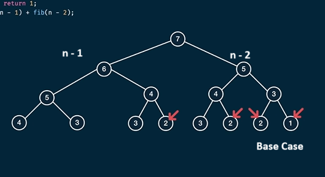

## Example 1: Fibonacci Problem

The Fibonacci sequence is defined as:

| n      | 1 | 2 | 3 | 4 | 5 | 6 | 7 | 8 | 9 | ... |
|--------|---|---|---|---|---|---|---|---|---|-----|
| fib(n) | 1 | 1 | 2 | 3 | 5 | 8 | 13| 21| 34| ... |

### Recursive Implementation

```python
def fib(n):
    if n <= 2:
        return 1
    return fib(n-1) + fib(n-2)
```

This implementation is slow due to repeated calculations in recursion.

#### Tracing `fib(7)`




- **Time Complexity:** O(2<sup>n</sup>)
- **Space Complexity:** O(n) (height of the recursion tree)

For example, `fib(50)` would require approximately 2<sup>50</sup> steps, which is computationally expensive.

#### Observing the Pattern


Notice that the left and right subtrees return the same values. We can reuse these calculations.

### Dynamic Programming Approach

Dynamic programming decomposes the problem into smaller subproblems and eliminates overlapping computations.

#### Memoization Implementation

```python
def fib(n, memo={}):
    if n in memo:
        return memo[n]
    if n <= 2:
        return 1
    memo[n] = fib(n-1, memo) + fib(n-2, memo)
    return memo[n]
```


This approach stores previously computed values, greatly improving efficiency.
